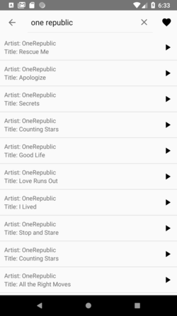

# iTunesSearchAndPlay
With this App you can search tracks from iTunes and reproduce the preview. In the toolbar, you can search for an artist or title. You can see details of a song by clicking on it and add it to you favourites by long-clicking it.

## Motivation
I developed this application due to a job application. I decided to utilize this opportunity to extend my portfolio.

## Getting started
This project uses the Gradle build system. To build this project, use the gradlew build command or use "Import Project" in Android Studio.

## Screenshots

## Libraries used
* [Android KTX](https://developer.android.com/kotlin)
* [RecyclerView](https://developer.android.com/guide/topics/ui/layout/recyclerview)
* [ConstraintLayout](https://developer.android.com/reference/android/support/constraint/ConstraintLayout)
* [Retrofit](https://square.github.io/retrofit/) for easy API calls
* [Gson Converter](https://github.com/square/retrofit/tree/master/retrofit-converters/gson) for easy conversion from JSON to Java Model class

## What I learned
* Using RESTful APIs
* Using MediaPlayer class

## Author
Andreas Pribitzer
